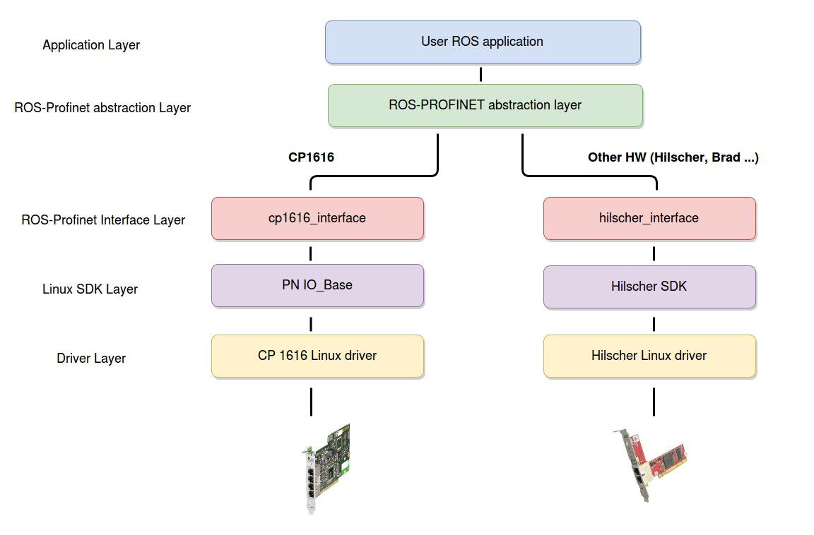
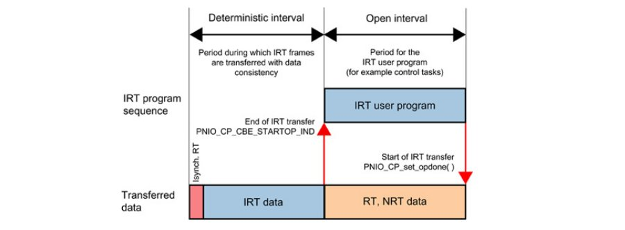
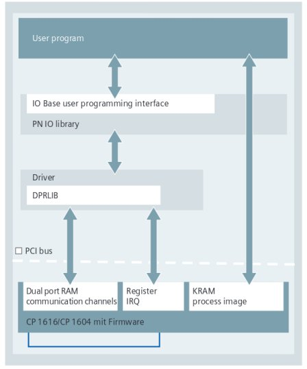
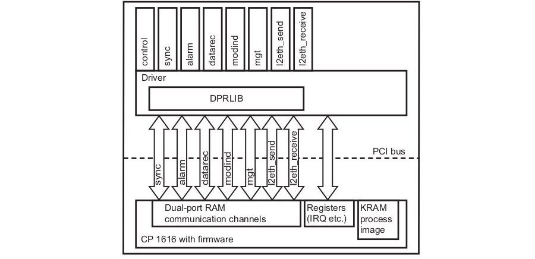
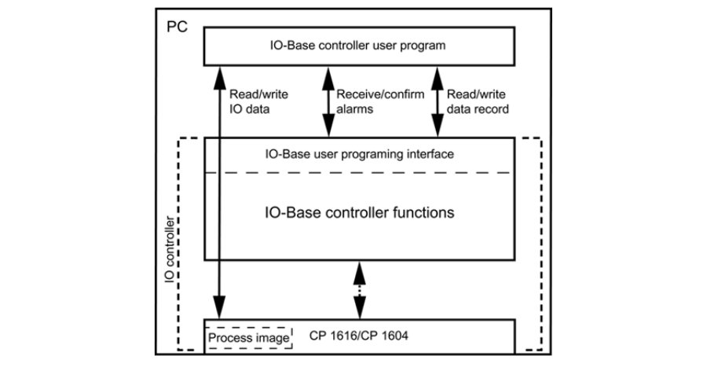

::
    
    REP: ???
    Title: ROS-Profinet wrapper (Version 1)
    Author: Frantisek Durovsky
    Status: Active
    Type: ToDo
    Created: 15-May-2015

Outline
=======

#. Abstract_
#. Motivation_
#. `Software Layers`_ 
#. `Design Assumptions`_
#. CP1616_

#. References_
#. Copyright_

Abstract
========

This REP describes the draft version of ROS-PROFINET wrapper. It is relevant to anyone using ROS-Industrial system in which PROFINET communication is required. Essential information about motivation, software layer architecture, development requirements, design assumptions as well as details about Linux real-time extension are included. 

Motivation
========

Hardware interfaces are top-level priority in ROS-Industrial Roadmap [#ros-i_roadmap]_, however if not considering *ros_canopen* package from IPA [#ros_canopen]_, there hasn't been any obvious progress in this field for quite a long time now. 

Mapping worldwide production system interfaces, Fieldbus technology which has been commonly used for more than 25 years with a wide variety of competing standards on the market [#fieldbus_wiki]_ is definitely current leader. Due to several reasons (support, available hardware components, opennes, real-time performance, scope) we decided for **PROFINET**, since integration of this standard could be one of the possible ways how to allow ROS-I systems to communicate with PCL's HMI's, OPCs and various industrial hardware.  

In addition to interfacing peripherals we would like to address following two scenarios in particular: 

- Integration of ROS-I system into existing industrial network (PLC as a master)
- Using ROS-I as a high level system for industrially driven mechanics (PC as a master)

The main goal of ROS-PROFINET wrapper is therefore to provide access to PROFINET network through ROS messages, services and actions. 

Software Layers
========

Since there is no universal *Socketcan package* for Profinet, following architecture was designed in order to make wrapper usable with various Profinet components:

ROS-PROFINET abstraction layer declares functions required for accessing common PROFINET components as well as ROS layer implementation through messages, services and actions. Particular hardware specific code is hidden in interface layer.  

Design Assumptions
=========
ToDo

CP1616
========
ROS-PROFINET wrapper is originally developed for use with Siemens CP1616 [#cp1616]_, which is a communication module, that enables PGs/PCs equipped with a PCI slot to be connected to PROFINET. Since CP1616 offers the communication possibilities of both **IO Controllers/IO Devices** (master/slave), various network configurations are possible. 

From user point of view, CP1616 acts like a standard PROFINET IO device - STEP7 or Simatic NCM tools are are required for basic topology setup, while the configuration is downloaded to CP1616 over the standard Ethernet. Afterwards, user's Linux (or other OS) application addresses existing configuration and access particular communication channels defined in SIMATIC project. 

CP1616 covers all three methods of exchanging data in PROFINET network:

- **Acyclic IO data exchange (NRT):** used for non-deterministic functions such as parametrization, video/audio transmissions and data transfer to higher level IT systems. with reaction times in the range of 100ms.

- **Cyclic non-isochronous real-time IO data traffic (RT):** Real time protocol with reaction up to 10ms cycle times. This represents a software-based solution for typical I/O applications.

- **Cyclic isochronous real-time IO data traffic (IRT):** Isochronous real-time protocol for demanding drive systems with cycle rates less than 1ms.  

All three methods might be used simultaneously. Bandwidth sharing as shown in following figure ensures that at least 50% of every IO cycle remains available for TCP/IP communications, whatever other functionality is being supported: 

Linux SW for CP1616
---------
**DK-16xx PN IO** [#dk16xx]_ is a software developement kit for integration of CP1616 module into various PCs  equipped by standard PCI slot. Linux CP1616 driver and user IO Base library sources as well as comprehensive documentation for porting to other OS are included. The kit is free of charge, it can be downloaded from Siemens support website [#siemens_sup]_ or ordered directly. The following graphic shows the software layers and communication paths among **CP1616 firmware, Driver, IO base library and User program**. 

Driver
---------

The driver is used to activate the CP1616 and to integrate the memory windows and IRQs of the CP1616 in the operating system. It:  

- processes interupts
- maps the process image on the CP for the IO Base library
- handles jobs between the IO Base library and CP firmware 
 
The following schematic shows the basic driver structure. The arrows indicate communications channels - ring buffers used for data exchange between driver and CP1616 firmware. The boxes above represent the device files **(/dev)** - driver access points for communication with user application.

Additional details are available in original documentation [#CP1616_doc]_ .

IO Base Library
---------

IO-Base user programming interface provides all basic functions that a **C/C++** user program requires to communicate with PROFINET IO devices. Library utilizes existing device files for   read/write IO data, send/receive alarms confirmations and read/write data records.

Original IO Base API including programming examples is available here [#io_base_doc]_.

Linux kernel & RTAI
---------

Current version of DK-16xx PN IO - V2.6 works only with Linux kernels **older than 3.8**. Since Ubuntu 12.04 LTS uses Linux kernel **3.11** and Ubuntu 14.04 LTS **3.13** it is not possible to make Linux CP1616 driver on latest Ubuntu LTS releases. Until new version of CP1616 driver is released, compilation and installation of *< 3.8 kernel* is required.    

In order to use isochronous real time (IRT), installation of the real-time extension RTAI [#rtai]_ is recommended, since without these extensions, Linux takes up to 1 ms to report interrupt to the application. RTAI patches are available only for certain Linux kernels, RTAI4.0 for example supports 3.4.67, 3.5.7, 3.8.13.  
 
With respect to enumerated limitations, for DK-16xx PN IO v2.6. we recommend following PC setup: 
 
- Standard OS:  Up to date Ubuntu 12.04 with Kernel 3.11.0.26
- Real-time OS: Ubuntu 12.04 with Kernel 3.5.7 + RTai 4.0

Installation guide for Linux Kernel 3.5.7 + RTAI extension is available here: TODO

References
========
.. [#ros-i_roadmap] ROS-Industrial Roadmap (https://github.com/ros-industrial-consortium/roadmapping/blob/master/RoadmappingDocument.md)
.. [#ros_canopen] ros_canopen library from IPA (http://wiki.ros.org/ros_canopen) 
.. [#fieldbus_wiki] Fieldbus overview (http://en.wikipedia.org/wiki/Fieldbus)
.. [#cp1616] Comunication procesor CP1616 (http://w3.siemens.com/mcms/industrial-communication/en/ie/system-interfacing/system-interfacing-pg-pc/cp1616/pages/cp1616.aspx)
.. [#profinet] Profinet What & Why (http://us.profinet.com/technology/profinet/)
.. [#siemens_sup] Development Kit DK-16xx PN IO (http://w3.siemens.com/mcms/industrial-communication/en/ie/system-interfacing/system-interfacing-pg-pc/development-kit-dk16xx/Pages/Default.aspx)
.. [#dk16xx] DK-16xx PN IO (http://w3.siemens.com/mcms/industrial-communication/en/ie/system-interfacing/system-interfacing-pg-pc/development-kit-dk16xx/Pages/Default.aspx)
.. [#CP1616_doc] PGH_DK-16xx_76 (https://support.industry.siemens.com/cs/document/26436652?lc=en-SA)
.. [#io_base_doc] PGH_IO-Base_76 (https://support.industry.siemens.com/cs/document/19779901?dti=0&lc=en-CZ)
.. [#rtai] RTAI (https://www.rtai.org/)

Copyright
========
This document has been placed in the public domain