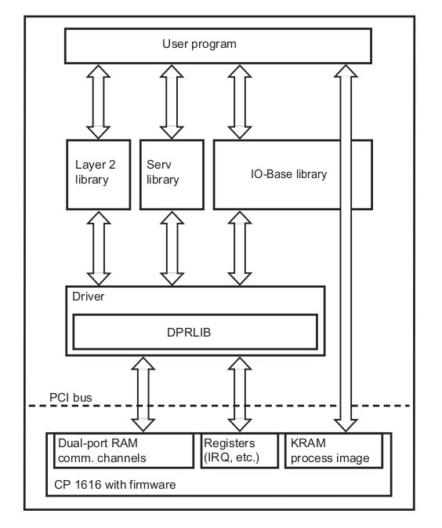

::
    
    REP: ???
    Title: ROS-Profinet wrapper (Version 1)
    Author: Frantisek Durovsky
    Status: Active
    Type: ToDo
    Created: 15-May-2015

Outline
=======

#. Abstract_
#. Motivation_
#. Definitions_
#. Requirements_
#. `Design Assumptions`_
#. `Todo's`_
#. References_
#. Copyright_

Abstract
========

Motivation
========

Hardware interfaces are top-level priority in ROS-Industrial Roadmap, however if not considering canopen package from IPA [#ros_canopen]_, there hasn't been any obvious progress in this field for quite a long time now. The goal of this project is therefore to develop a ROS-Profinet-wrapper for Siemens CP1616 Profinet PCI card [#cp1616]_, in order to provide new hardware interface to ROS-Industrial community. PROFINET [#profinet]_ is the world’s most advanced open Industrial Ethernet solution based on TCP/IP and IT standards providing real-time Ethernet communications all the way to the lowest level of the factory. We therefore believe that using PROFINET in combination with existing PCI communication processors is viable way how to allow ROS-I systems to communicate with PLC's, HMIs, OPC servers and various industrial hardware. 

CP1616
========
Communication module Siemens CP1616 [#cp1616]_ enables PGs/PCs equipped with a PCI slot to be connected to PROFINET IO. Since CP 1616 offers the communication possibilities of both IO Controllers/IO Devices (master/slave) usage in various network configurations is possible. 

.. image:: rep-I000X/cp1616.jpeg

From user point of view, CP1616 acts like a standard PROFINET IO device. SIMATIC Manager is used for a basic parametrization and topology setup, after which the configuration needs to be downloaded to CP1616 over the Ethernet for successful operation. User's Linux (or other OS) application adresses this configuration and access particular communication words previously defined in SIMATIC project. 

Existing Linux SW for CP1616
========
DK-16xx PN IO is a software developemnt kit for integration of CP1616 module into various PC based operating systems equipped by standard PCI slot. CP1616 driver and user library sourcecodes for Linux based systems as well as comprehensive documentation for porting to other OS systems in PDF format are included. The kit is free of charge, it can be downloaded from Siemens support website [#siemens_sup]_ or ordered directly.  

The following graphic shows the software layers and communictation path of DK-16xx PN IO software

References
========
.. [#ros_canopen] ros_canopen library from IPA (http://wiki.ros.org/ros_canopen) 
.. [#cp1616] Comunication procesor CP1616 (http://w3.siemens.com/mcms/industrial-communication/en/ie/system-interfacing/system-interfacing-pg-pc/cp1616/pages/cp1616.aspx)
.. [#profinet] Profinet What & Why (http://us.profinet.com/technology/profinet/)
.. [#siemens_sup] Development Kit DK-16xx PN IO http://w3.siemens.com/mcms/industrial-communication/en/ie/system-interfacing/system-interfacing-pg-pc/development-kit-dk16xx/Pages/Default.aspx

Copyright
========
This document has been placed in the public domain