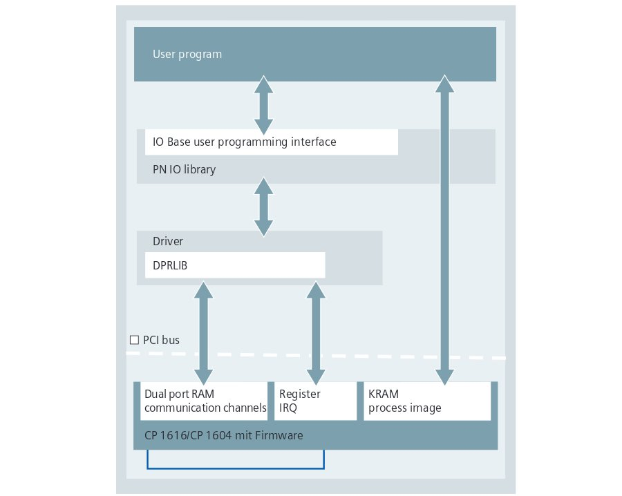

::
    
    REP: ???
    Title: ROS-Profinet wrapper (Version 1)
    Author: Frantisek Durovsky
    Status: Active
    Type: ToDo
    Created: 15-May-2015

Outline
=======

#. Abstract_
#. Motivation_
#. CP1616_
#. `Linux SW for CP1616`_
#. `Linux & real-time`_ 
#. Requirements_
#. References_
#. Copyright_

Abstract
========

ToDo

Motivation
========

Hardware interfaces are top-level priority in ROS-Industrial Roadmap [#ros-i_roadmap]_, however if not considering canopen package from IPA [#ros_canopen]_, there hasn't been any obvious progress in this field for quite a long time now. 

Filedbus technology has been commonly used in manufacturing processes for more than 25 years and there is a wide variety of competing standards on the market [#fieldbus_wiki]_. Due to several reasons (support, available hardware components, opennes, real-time performance, scope) we decided to experiment with Profinet, since we consider integration of this standard a viable way how to allow ROS-I systems to comunicate with PCL's HMI's, OPCs and various industrial hardware.  

We would like to address following two scenarios in particular 
  - Integration of ROS-I system into existing industrial network (PLC as a master)
  - Using ROS-I system as a high level system for industrially driven mechanics (PC as a master)

The goal of this project is therefore to develop a ROS-Profinet-wrapper for communication module Siemens CP1616. [#cp1616]_, in order to provide this progressive hardware interface to ROS-Industrial community.

CP1616
========
Communication module Siemens CP1616 [#cp1616]_ enables PGs/PCs equipped with a PCI slot to be connected to PROFINET IO. Since module offers the communication possibilities of both IO Controllers/IO Devices (master/slave), usage in various network configurations is possible. 

From user point of view, CP1616 acts like a standard PROFINET IO device - STEP7 or Simatic NCM tools are are required for basic topology setup while configuration is downloaded to CP1616 through standard Ethernet. Afterwards, user's Linux (or other OS) application adresses existing configuration and access particular communication channels defined in SIMATIC project. 

Linux SW for CP1616
========
DK-16xx PN IO [#dk16xx]_ is a software developemnt kit for integration of CP1616 module into various PCs  equipped by standard PCI slot. Linux CP1616 driver and user IO Base library sources as well as comprehensive documentation for porting to other OS is included. The kit is free of charge, it can be downloaded from Siemens support website [#siemens_sup]_ or ordered directly. The following graphic shows the software layers and communictation paths between CP1616 firmware, driver and IO base library

Driver
---------

The driver is used to activate the CP1616 and to integrate the memory windows and IRQs of the CP1616 in the operating system. It:  
  - processes interupts
  - maps the process image on the CP for the IO Base library
  - handles jobs between the IO Base library and the firmware on the CP
 
The following schematic shows the basic driver structure. The arrows indicate communications channels - ring buffers used for data exchange between driver and CP1616 firmware. The boxes above represent the device files (/dev) - driver access points for communication with user application.

For additional driver details please refer to original documentation [#CP1616_doc]_ .

IO Base Library
---------

IO-Base user programming interface provides all basic functions that a C user program requires to communicate with PROFINET IO devices. These are read/write IO data, send/receive alarms confirmations and read/write data records. 

The IO-Base library covers all three methods of exchanging data in PROFINET network:

- Acyclic IO data exchange (NRT): used for non-deterministic functions such as parametrization, video/audio transmissions and data transfer to higher level IT systems.

- Cyclic non-isochronous real-time IO data traffic (RT): TCP/IP layers are bypassed in order to give deterministic performance for automation applications in the 1-10mS range. This represents a software-based solution for typical I/O applications, inluding motion control and high performance requirements.

- Cyclic isochronous real-time IO data traffic (IRT): signal prioritization and scheduled switching deliver high precision synchronization for applications such as motion control. Cycle rates in the sub millisecond range are possible, with jitter in sub-microsecond range. This service requires hardware support in the form of readily available ASICs (Application specific integrated circuit). 

All three methods can be used simultaneously. Bandwidth sharing ensures that at least 50% of every IO cycle remains available for TCP/IP communications, whatever other functionality is being supported: 

Original IO Base API including programming examples is available here [#io_base_doc]_.

Linux & real-time 
=========
In order to use isochronous real time (IRT), installation of the real-time extension RTAI [#rtai]_ is recommended, since without these extensions, Linux takes up to 1 ms to report interrupt to the application. Current version of DK-16xx PN IO - V2.6 works only with Linux kernels older than 3.8. For use with Ubuntu 12.04 and ROS Hydro, we recommend following combination of Linux kernels: 

Standard OS:  Up to date Ubuntu 12.04 with Kernel 3.11.0.26
Real-time OS: Ubuntu 12.04 with Kernel 3.5.7 + RTai 4.0

Linux Kernel 3.5.7 + RTai extension installation guide is available here: TODO

Requirements
=========
ToDo

References
========
.. [#ros-i_roadmap] ROS-Industrial Roadmap (https://github.com/ros-industrial-consortium/roadmapping/blob/master/RoadmappingDocument.md)
.. [#ros_canopen] ros_canopen library from IPA (http://wiki.ros.org/ros_canopen) 
.. [#fieldbus_wiki] Fieldbus overview (http://en.wikipedia.org/wiki/Fieldbus)
.. [#cp1616] Comunication procesor CP1616 (http://w3.siemens.com/mcms/industrial-communication/en/ie/system-interfacing/system-interfacing-pg-pc/cp1616/pages/cp1616.aspx)
.. [#profinet] Profinet What & Why (http://us.profinet.com/technology/profinet/)
.. [#siemens_sup] Development Kit DK-16xx PN IO (http://w3.siemens.com/mcms/industrial-communication/en/ie/system-interfacing/system-interfacing-pg-pc/development-kit-dk16xx/Pages/Default.aspx)
.. [#dk16xx] DK-16xx PN IO (http://w3.siemens.com/mcms/industrial-communication/en/ie/system-interfacing/system-interfacing-pg-pc/development-kit-dk16xx/Pages/Default.aspx)
.. [#CP1616_doc] PGH_DK-16xx_76 (https://support.industry.siemens.com/cs/document/26436652?lc=en-SA)
.. [#io_base_doc] PGH_IO-Base_76 (https://support.industry.siemens.com/cs/document/19779901?dti=0&lc=en-CZ)
.. [#rtai] RTAI (https://www.rtai.org/)

Copyright
========
This document has been placed in the public domain